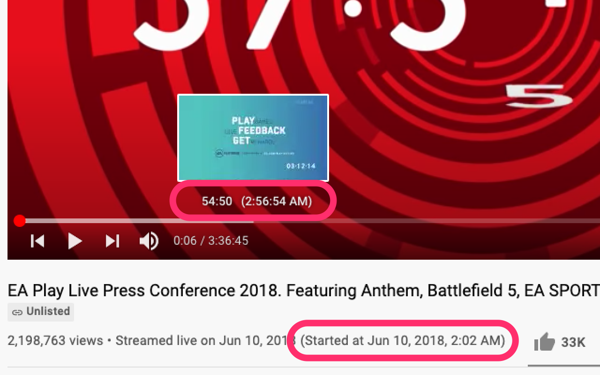
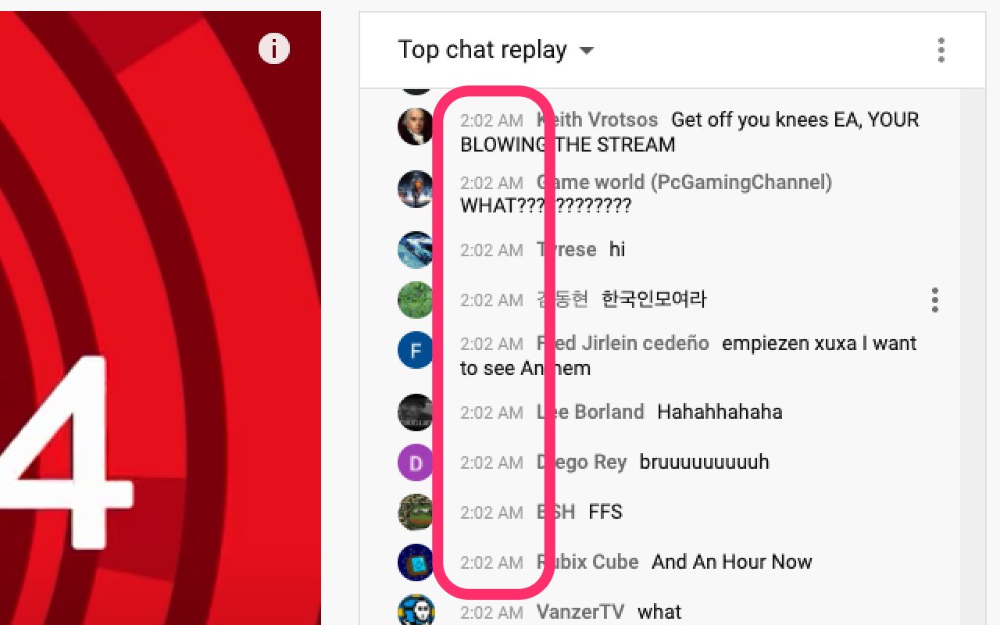

# Time Viewer for YouTube Live

[](https://github.com/fiahfy/youtube-live-time-viewer/actions/workflows/create-release.yml)

> Chrome extension that shows the current time on YouTube Live.

## Features

- Display video publishing time.
- Display time on seek bar and chat.

## Screenshots




## Installation

1. Download `dist.zip` from [releases page](https://github.com/fiahfy/youtube-live-time-viewer/releases) and unzip this file.
2. Open the Extension Management page by navigating to `chrome://extensions`.
3. Enable Developer Mode by clicking the toggle switch next to **Developer mode**.
4. Click the **LOAD UNPACKED** button and select the unpacked directory named `dist`.

## Development

```bash
# install dependencies
yarn

# watch files changed and reload extension
yarn dev
```
